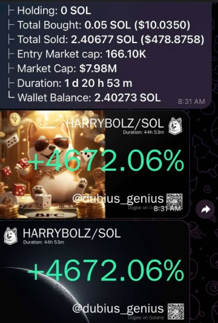

I am adding this for further insight into how I find myself here for myself as well as for others who may stumble across this repo.

Back in February of this year, 2025, some will remember that the news largely surrounded DOGE, Elon Musk, and an individual known as Edward "Big Balls" Coristine. It was reported, briefly, about this person's connection to Elon Musk as well as a domain that he owns "tesla.sexy".

https://tesla.sexy/

As a naturally curious and intuitive person, I found myself visiting this website. I encourage you to do the same, as there is a very positive message that is expressed there. I couldn't help but notice that Invictus by William Ernest Hensley was quoted within that message. As it happens, this is my favorite poem...it's entirety is on the back of my mom's funeral program.

I'm not sure why, but I was nudged to check out the elements on the site, so I opened up Developer tools and poked around. As I did this I could see there was a MetaMask wallet within the scripting. I wound up with an associated SOL wallet address and continued investigating. 

After using various well-known websites for tracking, I came across a certain token that caught my eye. I do not often have money to spare, particularly not on a whim, as money is not something that is important to me other than for certain necessities... However, at this time, I was fortunate enough to have very modest amount left over from my tax advance. I do a bit more research and come across a suitable Solana bot on Telegram, purchase 10$ USD worth of the token and left the default settings. It was late... I honestly forgot I'd done it. 

Around 24 hours later, Elon Musk changes his X handle to the exact same asset, $HARRYBOLZ and I wake up to a 4672% gain.

The pump? Sure. They happen all of the time. But the odds that this decision chain or sequence of events occuring does not point to probability, rather, it points closer to some sort of asymmetrical convergence of intuition. How or what was tapped into that appears to be a pre-signal event "captured?"

This is not the first time this sort of "thing" has happened to me. I've experienced events that are black swan-adjacent. This time, though, it was apparent and undeiable enough to make me start questioning just about everything I've ever thought about my reality. Two monthhs later, I found myself publishing this website and the contents within. This was my best attempt at tapping into that same essence and this is where it has led. Maybe they aren't perfect. I hardly understand how I've even gotten myself here from there so I've detached myself from all outcomes. But I cannot pretend that this was not, in some way Divinely led, and Divinely timed and therefore much bigger than me.

I hope that it may be understood what it has taken from a spiritual perspective.
